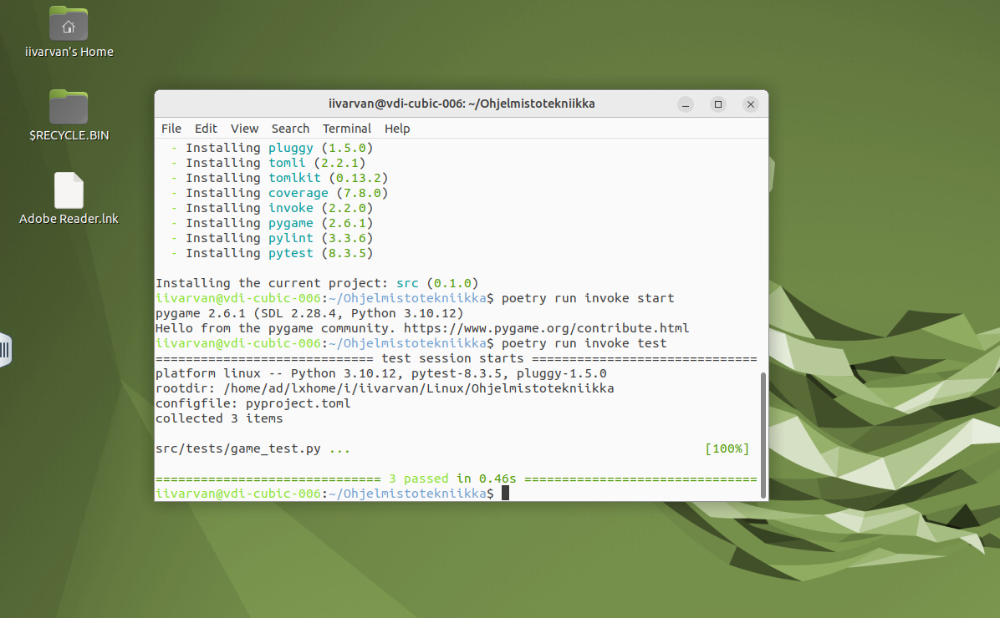

# Ohjelmistotekniikka
Balatro-inspiroitu noppapeli.

[Vaatimusmäärittely](https://github.com/Mrivu/Ohjelmistotekniikka/tree/main/dokumentaatio/vaatimusmaarittely.md)
[Arkkitehtuuri](https://github.com/Mrivu/Ohjelmistotekniikka/tree/main/dokumentaatio/arkkitehtuuri.md)

## Harjoitustyön toimivuus
Testasin toimivuutta virtuaaliympäristössä.



## Testeihin liittyvää
40% Coverage on teoriassa saavutettu, sillä testaan koodia, joka ei palauta mitään. Peliprojektissa on paljon koodia, kuten kuvien tai tekstin piirtämistä, jotai ei voi testata samalla tavalla, kuin funktioita jotka palauttavat jotain.

# Peliohjeet
- Noppien summa kuuluu olla yhtäsuuri tai suurempi kuin annettu luku, jotta taso läpäistään. Jos samaa numeroa on monta, siitä saa bonuksia. 
```
if amount == 3:
    mul = 1.5
if amount == 4:
    mul = 2
if amount == 5:
    mul = 3
```
- Työn alla: Tasojen läpäisystä saa kolikkoja, joilla voi ostaa eri päivityksiä.
# Asennus
## Vaatimukset
- Python 3.10
- Poetry 2.1.1
## Asennuksen vaiheet
```
git clone https://github.com/Mrivu/Ohjelmistotekniikka.git
```
```
cd Ohjelmistotekniikka
```
```
poetry install
```
```
poetry run invoke start
```

## Testaus
```
poetry run invoke test
```
## Testikattavuus
```
poetry run invoke coverage-report
```
Raportti generoituu _htmlcov_-hakemistoon.

## Pylint
```
poetry run invoke pylint
```