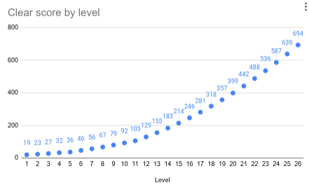

# Arkkitehtuuri

## Käyttöliittymä
Käyttöliittymä koostu kolmesta osasta: Kuva, Teksti ja Klikkaus.
Käyttöliittymää käsittelee Game-luokka.
Kuvat ladataan erikseen dictionaryyn kuvan nimellä. Esimerkkinä game.py:n funktio:
```
def load_images(self):
       self.sprites = {
           "restart": pygame.image.load("src/assets/DiceGameRe-roll.png"),
           ...
           "buy": pygame.image.load("src/assets/DiceGameBuy.png"),
           "shop": pygame.image.load("src/assets/DiceGameShop.png")
       }
```

Tämän jälkeen kuvat renderöidään normaalisti, mutta ne, joita pitää pystyä klikkaamaan muutetaan napeiksi käyttämällä button-luokkaa. Esimerkkinä game.py:n buttons dictionary:
```
self.buttons = {
   "reroll": button.Button(self.sprites["restart"], (1,1)),
   ...
   "buy-shop-size": button.Button(self.sprites["buy"], (1,1)),
   "buy-shop-rarity": button.Button(self.sprites["buy"], (1,1))
}
```
Napeille annetaan kuva ja koko. Voimme sitten kutsua napin draw() funktiota, joka piirtää kuvan mutta palauttaa myös boolen arvon riippuen siitä, onko nappi painettu. Esimerkkinä game.py:n simplifoitu koodi katsomaan jos jotain päivitystä on klikattu:
```
if upgrade.draw(self.display, (x, y)):
```
draw() funktion parametrit ovat siis näyttö jolle piirtää ja koordinaatit mihin piirtää. Lisäksi sillä on vaihtoehtoinen parametri disabled=True, jolla napin voi asettaa pois päältä. Tätä hyödynnetään esimerkiksi silloin, kun "re-roll" nappia ei enää kuuluisi pystyä painamaan kun kaikki uudelleenheitot on käytetty.

## Sovelluslogiikka
Sovelluslogiikan olennaiset toiminnot koostuvat luokista: Dice, Level ja Upgrade.

#### Dice
Käsittelee yksittäisen nopan logiikkaa. Omaa funktiot arpomaan nopalle uuden arvon ja heittämään nopan uudelleen, jos tämä on valittu. Luokan funktiot:
```
roll_dice():
get_result()
draw()
```

#### Level
Level käsittelee tason läpäisyn tarkistusta, noppien uudelleenheittoa, tasosta kerättyä rahaa ja suurinta osaa päivityksistä. Pisteiden laskussa funktio current_score() käy jokaisen nopan tuloksen läpi ja hakee sitten kaikkien noppien listasta täsmäävien noppien määrän:
```
for num in range(6): # Kaikki nopan silmäluvut
   amount = [die.get_result() for die in dice].count(num+1)
```
Tällöin voimme lisätä moninkertaiskertoimet:
```
if amount == 3:
   mul = 1.5
if amount == 4:
   mul = 2
if amount == 5:
   mul = 3
```
Luokan clear_score taas palauttaa tason numeron mukaisen vaikeustason seuraten matemaattista kaavaa, jonka kehitin itse arvioini pelinvaikeustason kasvun mukaan. Liitettynä on kuva vaikeustason käyrästä:



#### Upgrade
Upgrade toimii hyvin samalla tavalla kuin button-luokka, mutta pystyy käsittelemään päivitysten eri attribuutteja.

## Ohjelman rakenteeseen jääneet heikkoudet
Sovelluslogiikka ja käyttöliittymä ovat erillisissä funktioissa, mutta eivät eroteltu luokilla. Siispä ne eivät ole eroteltu kauhean selkeästi.