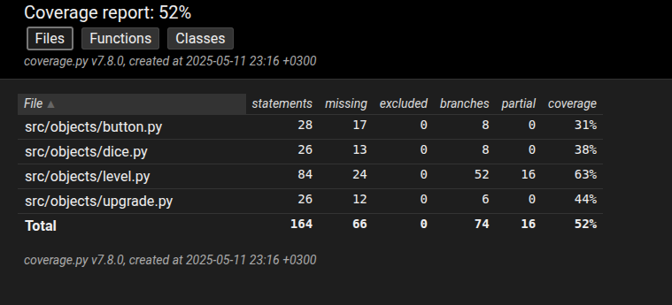
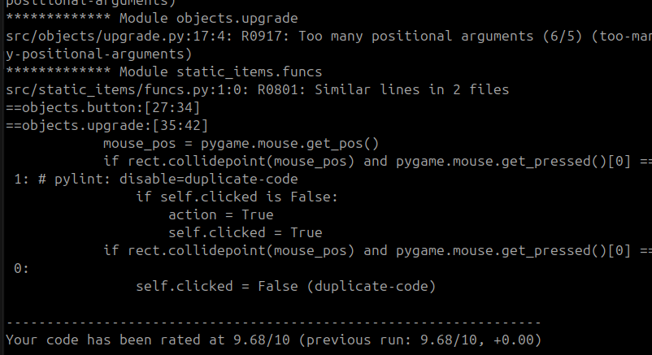

# Testausdokumentti

## Testauskattavuus

Game.py koostuu pääosin käyttöliittymästä, joten se jätetään pois. Annetut luokat kuitenkin sisältävät esimerkiksi draw funktiot. Nappejen painamisen testaus on mahdotonta, vaikka funktio palauttaakin jonkin arvon. Siispä teroiassa projekti saavuttaa testikattavuusrajan.

## Huomioitavaa
Koodissa on kierretty joitain pylint-virheitä, mutta kyseiset virheet liittyivät muun-muaassa siihen, ettei pylint tunnistanut pygamea. Pylint virheitä esiintyy, mutta ne ovat mielestäni kaikki turhia virhe-ilmoituksia. Esimerkiksi virhe: "Similar lines in 2 files" huomaa, että upgraden ja buttonin draw(), funktio on samanlainen. Käytän kummassakin kuitenkin samaa logiikkaa tutkimaan onko jotain asiaa painettu, koska ei ole mitään järkeä tehdä se erilla tavalla.

Pylint antaa kuitenkin koodilleni arvosanan 9.68/10.